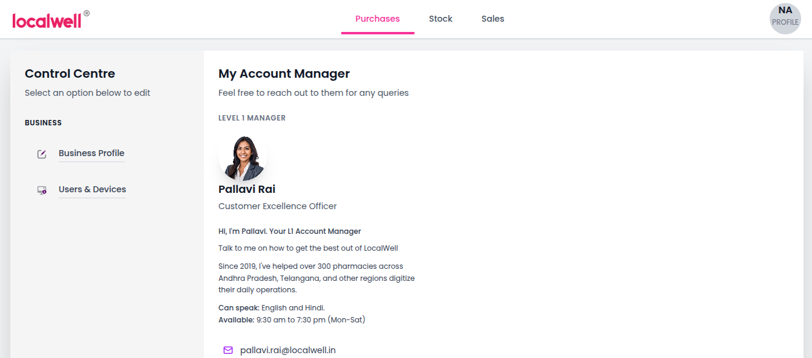

# LocalWell Dashboard

A modern, responsive dashboard application built with React and Vite, featuring a pharmacy management interface with account manager integration.

## 📸 Preview



*Replace this placeholder with your actual screenshot*

## ✨ Features

- **Modern UI Design**: Clean, professional interface matching Figma specifications
- **Tab-based Navigation**: Seamless switching between Purchases, Stock, and Sales
- **Account Manager Integration**: Dedicated manager contact card with communication options
- **Responsive Design**: Works perfectly on desktop and mobile devices
- **Custom Font Integration**: Poppins font for enhanced typography
- **State Management**: Simple and efficient routing without external dependencies

## 🛠️ Technologies Used

- **React 18**: Frontend framework
- **Vite**: Build tool and development server
- **Tailwind CSS**: Utility-first CSS framework
- **Lucide React**: Beautiful icon library
- **Poppins Font**: Google Fonts integration

## 📦 Installation

### Prerequisites

Make sure you have Node.js (v14 or higher) and npm installed on your machine.

### Step 1: Create Vite React Project

```bash
npm create vite@latest localwell-dashboard -- --template react
cd localwell-dashboard
```

### Step 2: Install Dependencies

```bash
# Install base dependencies
npm install

# Install required libraries
npm install lucide-react
npm install -D tailwindcss postcss autoprefixer
```

### Step 3: Setup Tailwind CSS

```bash
# Initialize Tailwind CSS
npx tailwindcss init -p
```

Update your `tailwind.config.js`:

```javascript
/** @type {import('tailwindcss').Config} */
export default {
  content: [
    "./index.html",
    "./src/**/*.{js,ts,jsx,tsx}",
  ],
  theme: {
    extend: {
      fontFamily: {
        'poppins': ['Poppins', 'sans-serif'],
      },
    },
  },
  plugins: [],
}
```

Add to your `src/index.css`:

```css
@tailwind base;
@tailwind components;
@tailwind utilities;
```

### Step 4: Replace App Component

Replace the contents of `src/App.jsx` with the LocalWell dashboard component code.

### Step 5: Run the Development Server

```bash
npm run dev
```

Visit `http://localhost:5173` to view the application.

## 🗂️ Project Structure

```
localwell-dashboard/
├── public/
│   └── vite.svg
├── src/
│   ├── components/
│   │   ├── Header.jsx
│   │   ├── Sidebar.jsx
│   │   └── AccountManagerCard.jsx
│   ├── pages/
│   │   ├── PurchasesPage.jsx
│   │   ├── StockPage.jsx
│   │   └── SalesPage.jsx
│   ├── App.jsx
│   ├── main.jsx
│   └── index.css
├── package.json
├── tailwind.config.js
├── vite.config.js
└── README.md
```

## 🧭 Routing System

This application uses a **custom state-based routing system** instead of React Router DOM for simplicity and better performance in the artifact environment.

### How Routing Works

1. **State Management**: Uses React's `useState` hook to track the active tab
2. **Tab Navigation**: Header component handles tab switching via `setActiveTab` function
3. **Conditional Rendering**: `renderCurrentPage()` function displays the appropriate component
4. **Active States**: Visual feedback shows which tab is currently active

### Navigation Structure

```javascript
const tabs = [
  { id: 'purchases', label: 'Purchases', path: '/' },
  { id: 'stock', label: 'Stock', path: '/stock' },
  { id: 'sales', label: 'Sales', path: '/sales' }
];
```

### Adding New Routes

To add a new route:

1. Create a new page component
2. Add the tab configuration to the `tabs` array
3. Update the `renderCurrentPage()` switch statement

```javascript
// Add new tab
{ id: 'reports', label: 'Reports', path: '/reports' }

// Add case in renderCurrentPage()
case 'reports':
  return <ReportsPage />;
```

## 🎨 Component Architecture

### Core Components

- **Header**: Navigation bar with logo, tabs, and profile section
- **Sidebar**: Control centre with business management options
- **AccountManagerCard**: Manager contact information and communication
- **Page Components**: Individual pages for each navigation tab

### Key Features

- **Font Integration**: Poppins font loaded via Google Fonts CDN
- **Icon System**: Lucide React icons for consistent visual elements
- **Responsive Design**: Tailwind CSS classes for mobile-first approach
- **State Management**: Local state for tab navigation and UI interactions

## 🚀 Available Scripts

```bash
# Development server
npm run dev

# Build for production
npm run build

# Preview production build
npm run preview

# Lint code
npm run lint
```

## 📋 Dependencies

### Core Dependencies
```json
{
  "react": "^18.2.0",
  "react-dom": "^18.2.0",
  "lucide-react": "^0.263.1"
}
```

### Development Dependencies
```json
{
  "vite": "^4.4.5",
  "tailwindcss": "^3.3.0",
  "autoprefixer": "^10.4.14",
  "postcss": "^8.4.24"
}
```

## 🎯 Customization

### Colors
The application uses a pink-purple color scheme:
- Primary Pink: `#E91E63`
- Purple Accent: `#7C3AED`
- Gray Tones: Tailwind's gray palette

### Typography
- Primary Font: Poppins (Google Fonts)
- Font Weights: 300, 400, 500, 600, 700

### Layout
- Sidebar Width: 320px (80 Tailwind units)
- Header Height: 64px (16 Tailwind units)
- Card Width: 384px (96 Tailwind units)

## 🔧 Configuration

### Vite Configuration
The default Vite configuration works perfectly for this project. No additional setup required.

### Tailwind Configuration
Custom font family and color extensions are configured in `tailwind.config.js`.

## 📱 Responsive Design

The application is fully responsive with:
- Mobile-first approach
- Flexible grid layouts
- Adaptive typography
- Touch-friendly interactions

## 🤝 Contributing

1. Fork the repository
2. Create a feature branch (`git checkout -b feature/amazing-feature`)
3. Commit your changes (`git commit -m 'Add amazing feature'`)
4. Push to the branch (`git push origin feature/amazing-feature`)
5. Open a Pull Request

## 📄 License

This project is licensed under the MIT License - see the [LICENSE](LICENSE) file for details.

## 🙋‍♂️ Support

For support and questions:
- Create an issue in the repository
- Contact: [your-email@example.com]

## 🚧 Future Enhancements

- [ ] Add React Router DOM for URL-based routing
- [ ] Implement data fetching and API integration
- [ ] Add user authentication
- [ ] Enhanced mobile responsiveness
- [ ] Dark mode support
- [ ] Real-time notifications
- [ ] Advanced search and filtering

---

**Built with ❤️ using React, Vite, and Tailwind CSS**
